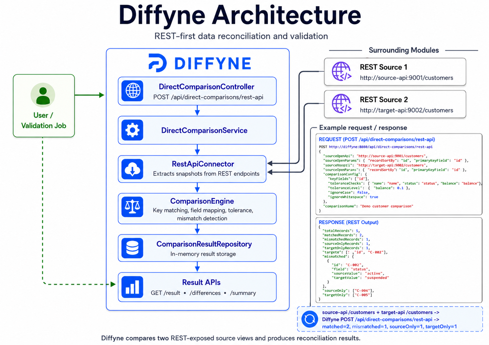

# Diffyne

Diffyne is a powerful tool for comparing data across different sources with a REST-first approach. It enables users to identify discrepancies between data sets quickly and efficiently.

## Overview

Diffyne allows you to:

- Compare data from multiple REST API endpoints
- Detect differences between data sources
- Identify records that exist in one source but not the other
- Find field-level differences within matching records
- Map fields between sources with different naming conventions or schemas
- Configure tolerance levels for numeric comparisons
- Schedule and manage comparison jobs

## Key Features

- **REST-First Architecture**: All data access is through REST APIs
- **Flexible Comparison**: Configure key fields, fields to compare with name mapping support for different schemas, and tolerance levels
- **Connector Abstraction**: REST API connectors are implemented today, with Kafka and Salesforce connectors present as scaffolding for future work
- **In-Memory Storage**: Uses in-memory repositories for efficient runtime storage
- **Comprehensive Analysis**: Detailed reports showing matched, mismatched, and unique records
- **Field-Level Differences**: Identifies exactly which fields differ between records
- **Field Name Mapping**: Map fields between sources with different schemas or naming conventions



## Usage Examples

The `demo/` folder contains a runnable Docker Compose demo with three Java Spring Boot services:

- `source-api`: this Java Spring Boot app with the `demo-source` profile on port `9001`
- `target-api`: this Java Spring Boot app with the `demo-target` profile on port `9002`
- `diffyne`: this Spring Boot app on port `8081`


Run the demo:

```bash
./demo/run-demo.sh
```

The script builds and starts the services, calls Diffyne's direct REST comparison endpoint, and saves the live response to `demo/latest-output.json`. The request body used by the script is stored in `demo/request.json`, and the expected summarized result is stored in `demo/example-output.json`.

Stop the demo services when finished:

```bash
docker compose -f demo/docker-compose.yml down
```

The source REST input is served by `GET http://source-api:9001/customers`:

```json
[
  {"id": "C-001", "name": "Alice Jones", "status": "active", "balance": 100.0},
  {"id": "C-002", "name": "Bob Smith", "status": "active", "balance": 200.0},
  {"id": "C-003", "name": "Carol White", "status": "inactive", "balance": 300.0},
  {"id": "C-004", "name": "Source Only", "status": "pending", "balance": 400.0}
]
```

The target REST input is served by `GET http://target-api:9002/customers`:

```json
[
  {"id": "C-001", "name": "Alice Jones", "status": "active", "balance": 100.0},
  {"id": "C-002", "name": "Bob Smith", "status": "suspended", "balance": 200.0},
  {"id": "C-003", "name": "Carol White", "status": "inactive", "balance": 300.05},
  {"id": "C-005", "name": "Target Only", "status": "active", "balance": 500.0}
]
```

Diffyne compares those inputs with `POST http://diffyne:8081/api/direct-comparisons/rest-api`:

```json
{
  "sourceOneUrl": "http://source-api:9001/customers",
  "sourceOneParams": {
    "recordsPath": "$",
    "primaryKeyField": "id"
  },
  "sourceTwoUrl": "http://target-api:9002/customers",
  "sourceTwoParams": {
    "recordsPath": "$",
    "primaryKeyField": "id"
  },
  "comparisonConfig": {
    "keyFields": ["id"],
    "fieldsToCompare": {
      "name": "name",
      "status": "status",
      "balance": "balance"
    },
    "toleranceLevels": {
      "balance": 0.1
    },
    "ignoreCase": false,
    "ignoreWhitespace": true
  },
  "comparisonName": "Demo customer comparison"
}
```

The saved output example shows the intended categories:

```json
{
  "totalRecords": 5,
  "matchedRecords": 2,
  "mismatchedRecords": 1,
  "sourceOnlyRecords": 1,
  "targetOnlyRecords": 1,
  "exampleRecords": {
    "matched": ["C-001", "C-003"],
    "mismatched": [
      {
        "id": "C-002",
        "field": "status",
        "sourceValue": "active",
        "targetValue": "suspended"
      }
    ],
    "sourceOnly": ["C-004"],
    "targetOnly": ["C-005"]
  }
}
```

## Setup & Configuration

### Requirements

- Java 21
- Spring Boot 3.4.4
- Maven

### Configuration

The application runs with default settings and requires no additional configuration. You can customize behavior by creating an `application-local.properties` file in `src/main/resources/` if needed:

```properties
# Server configuration
server.port=8081

# Logging configuration
logging.level.com.syv.data.Diffyne=INFO
```

### Running the Application

```bash
./mvnw clean install
./mvnw spring-boot:run
```

**Note**: The application is designed with a REST-first approach and uses in-memory storage for all operations.

Kafka and Salesforce connector classes exist in the codebase, but they are currently stubs and should not be described as supported integrations.

## Project Structure

- **Controllers**: REST endpoints for triggering comparisons and retrieving results
- **Services**: Core comparison and data extraction logic
- **Connectors**: Adapters for REST API data sources, plus placeholder connector types for future integrations
- **Models**: Data structures for comparisons, results, and differences
- **Repositories**: In-memory storage interfaces for runtime data

## Field Mapping

Diffyne supports comparing data sources with different field naming conventions through field mapping. This is achieved by configuring the `fieldsToCompare` parameter as a map instead of an array:

```json
"fieldsToCompare": {
  "source_field1": "target_field1",
  "source_field2": "target_field2",
  "common_field": "common_field"
}
```

In this example:
- `source_field1` in the source data will be compared with `target_field1` in the target data
- `source_field2` in the source data will be compared with `target_field2` in the target data
- Fields with the same name in both sources can be mapped with the same name

This feature is particularly useful when:
- Two systems use different naming conventions for the same data
- You need to compare data across different API schemas
- You're comparing data from systems that have evolved differently over time

## Testing

The project includes comprehensive unit and integration tests for all components.

```bash
# Run all tests
./mvnw test

# Run a specific test
./mvnw test -Dtest=DirectComparisonControllerTest
```

## LLM Analysis Snapshot

To aggregate the significant project files into a single text file for LLM analysis:

- macOS or Linux: `./aggregate-for-llm.command`
- Windows: `aggregate-for-llm.bat`

The default output is `.llm-analysis/diffyne-llm-context.txt` in the project root.
